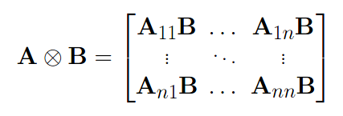

[](https://coveralls.io/github/nickelnine37/pykronecker)

# Overview

This library contains tools for performing efficient matrix operations with [Kronecker products](https://en.wikipedia.org/wiki/Kronecker_product). The Kronecker product between two square matrices *A* and *B* is constructed as follows. 



If *A* has size (*n* x *n*), and *B* has size (*m* x *m*), then their kronecker product has size (*mn* x *mn*). The aim of this package is to efficiently caluclate matrix-vector multiplications in this expanded space.


# Installation

```
pip3 install pykronecker
```

# Usage

We create instances of a `KroneckerOperator` class, which can be broadly treated as if it is a square numpy array. These objects are designed to be used with the `@` syntax for matrix multiplication. 

## Basic operators

Create a `KroneckerProduct` from two or more square numpy arrays. 

```python
import numpy as np
from pykronecker.operators import KroneckerProduct

A = np.random.normal(size=(5, 5))
B = np.random.normal(size=(6, 6))
x = np.random.normal(size=5 * 6)

C = KroneckerProduct([A, B])
print(C @ x) # calculate efficiently using the @ operator
```

A `KronekerSum` can be used in much the same way. The Kronecker sum of two square matrices *A* and *B* is defined as folows.


```python
from pykronecker.operators import KroneckerSum

D = KroneckerSum([A, B])
print(D @ x)
```

`KroneckerDiag` provides support for diagonal matrices.

```python
from pykronecker.operators import KroneckerDiag

E = KroneckerDiag(np.random.normal(size=5 * 6))
print(E @ x)
```

## Deriving new operators

All three of these objects can be added or multiplied together arbitrarily to create new composite operators. In this way, they can be treated similarly to literal numpy arrays. 

```python
F = C @ D + C @ E
print(F @ x)
```

Other possible operations include transposing with `.T`, and multiplying/dividing by a scalar. 

```python
G = 2 * F.T + E / 5 
print(G @ x)
```

## Block operators

*Documentation coming soon*

## Other features

For operators that are products of `KroneckerProduct`s and `KroneckerDiag`s, we can find the inverse with `.inv()`.

```python
H = (C @ E).inv()
print(H @ x)
```

Summing down an axis or over the whole matrix is supported.

```python
print(F.sum(0))
print(F.sum(1))
print(F.sum())
```

As is conversion to a literal array 

```python
print(H.to_array())
```

